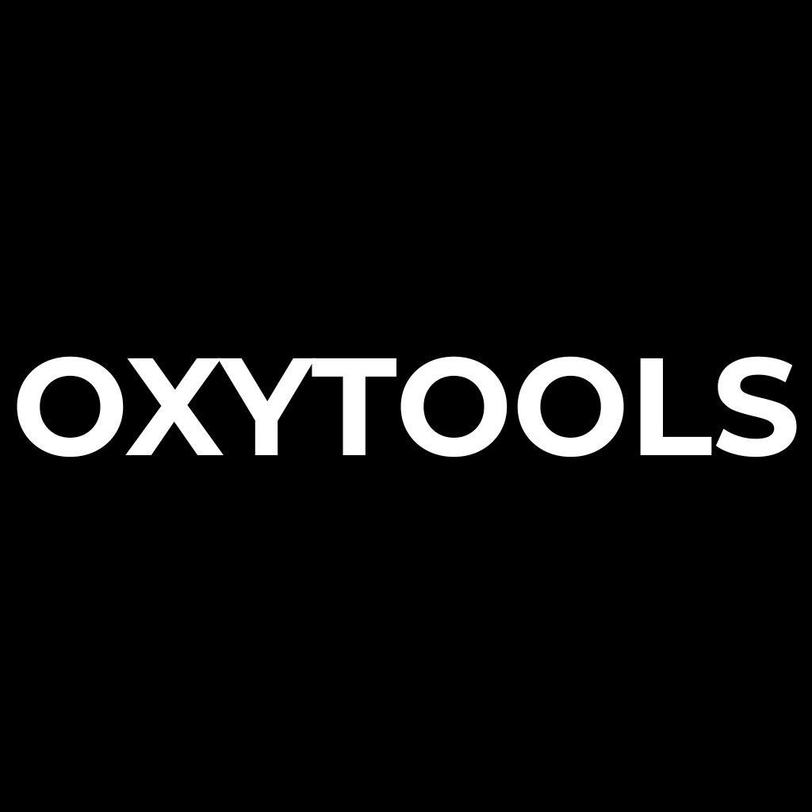

# Oxytools & Oxytools_Office

# Oxytools

Oxytools is a Rust portable GUI toolkit that brings together a collection - such as conversion, renaming, tagging, and scraping - with bundled binaries (ffmpeg, ffprobe, mkvpropedit).

Oxytools_Office is a restricted version of Oxytools with less modules and does not include an API or network connectivity. It is designed for professional use.

---
## Languages supported
- English
- French
---
## Modules and key differences

| Differences | Oxytools | Oxytools_Office |
|--------|:-----:|:----------:|
| Archives (7Z, TAR, ZIP) | ✅ | ✅ |
| Audio (AAC, FLAC, MP3, OGG) | ✅ | ❌ |
| Documents (DOCX, HTML, MD, LaTeX, ODT, PDF...) | ✅ | ✅ |
| File renamer (case, find, insert, numbering, replace...) | ✅ | ✅ |
| Pictures (JPG, JXL, PNG, WebP…) | ✅ | ✅ |
| Scraper (Fanart, TMDB) | ✅ | ❌ |
| Tagger (MKV tagging) | ✅ | ❌ |
| Tools (directory and file listing)| ✅ | ✅ | ✅ |
| Video (mkv, mp4, webm) | ✅ | ❌ |
| Bundled binaries (ffmpeg, ffprobe, mkvpropedit) | ✅ | ❌ |
| Internet access | ✅ | ❌ |
---
## Platforms

| | Linux ARM64 | Linux x64 | Mac ARM64 | Windows x64 |
|---|:---:|:---:|:---:|:---:|
| Oxytools | ✅ | ✅ | ✅ | ✅ |
| Oxytools_Desk | ✅ | ✅ | ✅ | ✅ |

The source code is Mac ARM ready.
I don't have any Mac, so I need to compile this with Github CI, which cost a lot of ratio.

---
## Building from source
You need those binaries to build
FFmpeg, FFprobe : https://ffmpeg.org — LGPLv2.1+
mkvpropedit (MKVToolNix) : https://mkvtoolnix.download — GPLv2.
You can also find them in assest in the releases.

| Version| OS | Command |
|---|---|---|
| Oxytools | Linux x64 | cargo dist |
| Oxytools | Windows x64 | cargo dist |
| Oxytools | Linux arm | cargo dist-arm|
| Oxytools Office | Linux x64 | cargo dist-office |
| Oxytools Office | Windows x64 | cargo dist-office |
| Oxytools Office | Linux arm | cargo dist-office-arm|
---
## Quick Start

1. Download the latest release from [Releases](../../releases)
2. Run the executable - no installation needed
3. Drop your files or browse to select them
4. Choose your output format
5. Click "Execute"

---
## License

This project is licensed under the GNU General Public License v3.0 — see Licenses.md for details.

---
## Roadmap
## 🔴 NOW
## 🟡 NEXT
 - ### Release:
    - Chocolatey
    - MS Store
    - Winget
## 🔵 LATER
* ### Tag
    * Tag management, complete custom field, add field
---